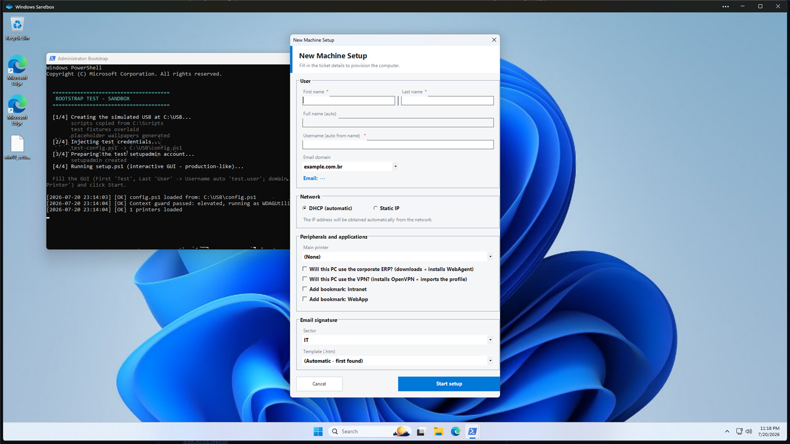

# 🖥️ Windows 11 — Automated Provisioning

[](https://github.com/bytedump/windows-automatization/actions/workflows/ci.yml)


Hands-free provisioning of Windows 11 machines from a single USB drive. An
`autounattend.xml` answer file installs Windows with **zero clicks**, then a PowerShell
GUI (`setup.ps1`) configures everything a help-desk deployment needs — user, network,
printer, apps, Outlook signature — and hands the machine over ready to use.



*Phase A GUI running inside Windows Sandbox with the test fixtures — input form on top,
live progress bar + streaming log below.*

## ✨ Features

- **Zero-click install** — boot from the USB straight to the desktop, full OOBE skipped
- **One form, everything automatic** — the technician types name/domain/network/printer once;
  the username, PC name (BIOS serial) and email derive themselves
- **Two-phase flow** — machine setup as admin (Phase A) → reboot → per-user setup in the new
  user's own session (Phase B) → SYSTEM cleanup that zeroes **and verifies** the AutoLogon secret
- **Parallel installers** — Office (ODT), Ninite, Belarc run concurrently to cut wall-clock time
- **Fail-closed disk guard** — the install proceeds only when exactly one fixed disk is confirmed
- **No secrets in the repo** — git ships templates; real credentials live only on the USB, all gitignored
- **Config-driven extras** — network printers, WiFi (WPA3 transition), OpenVPN profile, corporate
  browser bookmarks, desktop shortcuts, optional vendor cloud-agent toolkit
- **Tested** — Pester units on pwsh 7 **and** Windows PowerShell 5.1 (the production runtime),
  PSScriptAnalyzer lint and a gitleaks secret scan on every push

## ⚙️ How it works

```
USB boot ─► autounattend.xml        zero-click Windows 11 Pro install (pt-BR, OOBE skipped)
         ─► Phase A · setup.ps1     GUI as bootstrap admin: rename PC, create user, network,
                                    printers, apps — then stage the handoff and reboot
         ─► Phase B · phase-b.ps1   new user's own session: Outlook signature, wallpaper,
                                    bookmarks, desktop shortcuts, default printer, VPN profile
         ─► Cleanup · cleanup.ps1   SYSTEM: zero + verify the AutoLogon, remove staging
```

<details>
<summary><b>Two-phase handoff internals</b></summary>

Provisioning splits so per-user work runs in the **new user's own session** (no impersonation)
while machine setup keeps admin rights. Phase A stages `C:\ProgramData\CorpSetup` (`state.json` +
scripts + signature subtree), registers two scheduled tasks, arms a **one-shot AutoLogon** for the
new user and reboots. `state.json` carries **no credential** — the only secret in flight is the
one-boot plaintext AutoLogon password in `HKLM\…\Winlogon` (Winlogon has no DPAPI option), which
`AutoLogonCount=1` makes Windows consume even if cleanup never runs, and `cleanup.ps1` (SYSTEM)
zeroes + verifies at the end. The flow is gated by `-EnableHandoff`; the test harness never passes
it, so the Sandbox never reboots.
</details>

<details>
<summary><b>Fail-closed disk guard</b></summary>

`autounattend.xml` wipes `DiskID=0`, which is only safe with a **single** fixed disk.
`guard-disk.cmd` runs in WinPE **before** `DiskConfiguration` and lets the install proceed only
when it confirms *exactly one* fixed disk (WMIC primary, `diskpart` fallback covering
EN/pt/es/it/fr/de WinPE); any other outcome — zero parsed, more than one, tooling error, or the
script missing from the media — ends in `wpeutil shutdown` before anything is wiped.
Test the guard in a VM with two disks before relying on it.
</details>

## 🚀 Quick start

Done **once** per master USB; every machine boot after that is hands-free.

1. **Burn the boot USB with [Rufus](https://rufus.ie)** (GPT/UEFI) from the **Windows 11
   Portuguese (Brazil)** multi-edition ISO — and leave every box in Rufus's
   "Windows User Experience" dialog **unchecked** (ticking any writes Rufus's own
   `autounattend.xml`, which overrides this one).
2. **Copy the repo files** to the USB root.
3. **Run the wizard** — double-click `build.bat`. It prompts for every value (passwords hidden),
   generates BOTH `config.ps1` and `autounattend.xml`, auto-detects wallpapers/apps/drivers by
   folder scan, and reports which USB assets are still missing.
4. **Create `printers.json`** from `printers.example.json`, then **drop the binaries** the
   installers expect: `ninite.exe`, the `Office/` ODT folder, `belarc.exe`, `Drivers Epson/`,
   `WebAgent/`, the wallpaper, `signatures-2026/` templates, and optionally `CloudAgent/` and
   `VPN/` (see the [USB layout](#-usb-drive-layout)).
5. **Boot the target machine from the USB** — the rest is automatic.

> The bootstrap password typed in step 3 is temporary: `setup.ps1` rotates it on first login and
> then **deletes `autounattend.xml` from the USB** (it embeds that password base64-encoded).
> Re-run the wizard to regenerate it before imaging the next machine — Enter keeps every
> existing value, custom `$Path*` locations included.

<details>
<summary><b>Why the ISO language must match (pt-BR)</b></summary>

`autounattend.xml` requests `UILanguage = pt-BR`. An en-US ISO does not ship the pt-BR language
pack in `boot.wim`, so Setup cannot apply it and stops on the language/keyboard screen. The
region/locale is hardcoded (pt-BR, ABNT2, Brasília time zone) because the tool targets Brazilian
deployments — to retarget, change `InputLocale`/`SystemLocale`/`UILanguage`/`UserLocale` and
`TimeZone` in `autounattend.template.xml`.
</details>

<details>
<summary><b>Office via ODT (offline install)</b></summary>

Put the ODT bootstrapper (`setup.exe`, from <https://aka.ms/ODT>) and a `configuration.xml`
(copy `configuration.example.xml`) in `<USB>\Office\`. For offline installs, pre-download the
bits once — `cd <USB>\Office; .\setup.exe /download configuration.xml` — and every machine then
installs from the USB with no internet. Without the download, each machine pulls ~2–4 GB from
the Microsoft CDN at install time.
</details>

## 💾 USB drive layout

```
USB Root/
  ├── autounattend.xml          ← GENERATED by build-usb.ps1 (gitignored — has the bootstrap password)
  ├── setup.ps1                 ← Post-installation script (GUI) — Phase A
  ├── phase-b.ps1               ← Phase B (new user session): bookmarks, desktop shortcuts, wallpaper, signature, default printer, VPN profile
  ├── cleanup.ps1               ← Cleanup (SYSTEM): zero AutoLogon, unregister tasks, delete staging
  ├── run.bat                   ← Manual fallback to re-run setup.ps1
  ├── build.bat                 ← Double-click launcher for build-usb.ps1
  ├── guard-disk.cmd            ← Fail-closed disk guard, run from autounattend in WinPE
  ├── config.ps1                ← Credentials and paths (generated by the wizard — gitignored)
  ├── printers.json             ← Printer list (copy from printers.example.json — gitignored)
  ├── ninite.exe                ← Download pre-configured at ninite.com
  ├── belarc.exe                ← Belarc Advisor installer
  ├── wallpaper.jpg             ← Wallpaper (filename set in config.ps1)
  ├── Office/                   ← ODT: setup.exe + configuration.xml (+ pre-downloaded Office/Data/)
  ├── Drivers Epson/            ← Extracted Epson INF driver (registered silently via pnputil)
  ├── WebAgent/windows/         ← WebAgent .msi installer
  ├── CloudAgent/               ← Vendor cloud-agent toolkit (optional): installer bat + its exes
  ├── VPN/                      ← OpenVPN (optional): .msi installer + .ovpn profile (gitignored)
  └── signatures-2026/          ← Outlook signature templates (gitignored)
        └── {domain}/{Sector}/user.htm
```

## 🔧 Configuration

Everything lives in `config.ps1` on the USB (never in git). The wizard writes it for you;
`config.example.ps1` documents every variable. The groups:

| Group | Variables |
|---|---|
| Credentials | `$AdminAccount`, `$AdminNewPass`, `$UserInitialPass` |
| Email / GUI | `$EmailDomains` (dropdown) |
| Network | `$WifiSSID`/`$WifiPass` (always DHCP), `$StaticGateway`/`$StaticPrefixLength`/`$DnsServers` (Ethernet static option) |
| Wallpaper | `$WallpaperFile` + `$WallpaperByDomain` per-domain override |
| Asset paths | `$PathOffice`, `$PathBelarc`, `$PathEpson`, `$PathWebAgent`, `$PathSignatures`, `$PathVPN` |
| Cloud agent (optional) | `$PathCloudAgent`, `$CloudAgentInstaller`, `$CloudAgentInstallDir` — empty path = step skipped |
| Bookmarks | `$Bookmarks` (one GUI checkbox per link, seeded loose on the bar of Chrome/Edge/Firefox) + `$DesktopShortcutBookmarks` (which ones also get a desktop `.url`) |

## 🔒 Security model

No secret is committed — the repo holds templates, real values are created on the USB at build
time, and CI runs gitleaks over the full history on every push.

| Item | Where it lives |
|---|---|
| Bootstrap admin password | Only in the **generated** `autounattend.xml` (gitignored). Rotated on first login, then the file is **deleted** from the USB and the `Panther\unattend.xml` copy scrubbed |
| Phase B AutoLogon | Plaintext in `HKLM\…\Winlogon` for **one boot** (`AutoLogonCount=1` self-clears); `cleanup.ps1` (SYSTEM) zeroes **and verifies** it. `state.json` never holds a credential |
| Real passwords, WiFi, printer IPs, signatures, VPN profile | Only in `config.ps1` / `printers.json` / `signatures-2026/` / `VPN/` — all gitignored, all on the USB |
| Setup log | Credentials are never written to it |

> **Treat the prepared USB as a secret.** Until `setup.ps1` first runs, it carries live
> credentials in cleartext (`config.ps1`, and the bootstrap password base64-encoded — trivially
> reversible — in `autounattend.xml`). Keep it locked away and use **BitLocker To Go** or an
> equivalent encrypted volume.

## 🧪 Testing

CI ([`ci.yml`](.github/workflows/ci.yml)) runs on every push/PR:

| Check | Tool |
|---|---|
| Lint | PSScriptAnalyzer ([settings](PSScriptAnalyzerSettings.psd1)) |
| Unit tests, pwsh 7 **and** PowerShell 5.1 | Pester 5 ([`tests/unit/`](tests/unit)) — the 5.1 run catches BOM/encoding bugs pwsh masks |
| Secret scan (full history) | gitleaks ([`.gitleaks.toml`](.gitleaks.toml)) |
| Answer files well-formed | `[xml]` parse |

Run locally: `Invoke-Pester -Path .\tests\unit -Output Detailed`

**End-to-end in Windows Sandbox** (throwaway VM, fake credentials, no risk to the host):
double-click `tests\run-sandbox.bat` — it stages everything and opens the Sandbox, where the GUI
runs against test fixtures (domain `example.com.br`, sector `IT`, printer `Test Printer`) and
prints `RESULT: PASSED/FAILED`. Details and manual re-run steps: [`tests/SANDBOX-COMMANDS.txt`](tests/SANDBOX-COMMANDS.txt).
Boot/answer-file/disk-guard behaviour needs a real VM (Hyper-V Gen 2 with the ISO; add a second
disk to confirm the guard aborts).

## 🩺 Troubleshooting

| Symptom | Cause | Fix |
|---|---|---|
| Setup stops on the language/keyboard screens | en-US ISO has no pt-BR pack — or the 24H2/25H2 "ConX" setup ignores the locale settings | Burn the **pt-BR ISO**; for ConX run `force-legacy-setup.ps1 -UsbDrive E` (edits `boot.wim` to launch the legacy setup — test in a VM first) |
| Freezes at "searching for disks" | BIOS in **RAID On / Intel VMD** — WinPE ships no VMD driver | Switch BIOS to **AHCI/NVMe** (safe: the disk is wiped anyway), or drop the extracted IRST F6 driver into `$WinPEDriver$\` on the USB root |
| "Installing Windows" looks frozen | Slow or dying USB stick | Wait ≥ 30 min; use a rear USB 3.0 port; health-test with `Get-FileHash E:\sources\install.wim` |
| AutoLogon does not fire (24H2/25H2) | Credential Guard blocks plaintext AutoLogon | Log in once manually — the flow still completes via `FirstLogonCommands` / the scheduled task. Do **not** disable Credential Guard |
| A `cmd` console flashes in WinPE | The disk guard's `RunSynchronous` command | Expected — not an error |

## 🗂️ Repository files

| File | Description |
|---|---|
| `autounattend.template.xml` | Answer-file template (placeholders for admin user/password) |
| `build-usb.ps1` / `build.bat` | USB build wizard: generates `autounattend.xml` + `config.ps1`, runs the asset check |
| `setup.ps1` / `run.bat` | Phase A post-install GUI + manual fallback launcher |
| `phase-b.ps1` | Phase B: per-user work in the new user's own session |
| `cleanup.ps1` | SYSTEM teardown: zero + verify AutoLogon, unregister tasks, delete staging |
| `guard-disk.cmd` | WinPE fail-closed disk guard |
| `force-legacy-setup.ps1` | Forces legacy Setup on the boot USB (24H2/25H2 ConX fix) |
| `collect-machine-info.ps1` / `.bat` | Standalone GUI: RAM/storage/MAC/serial/AnyDesk ID in one copy-paste-ready window |
| `config.example.ps1` / `printers.example.json` / `configuration.example.xml` | Templates for the gitignored real files |
| `tests/` | Pester unit tests (CI), the Windows Sandbox harness and fake fixtures |
| `.github/workflows/ci.yml` / `PSScriptAnalyzerSettings.psd1` / `.gitleaks.toml` | CI, lint ruleset, secret-scan config |

## 📄 License

Released under the [MIT License](LICENSE).
